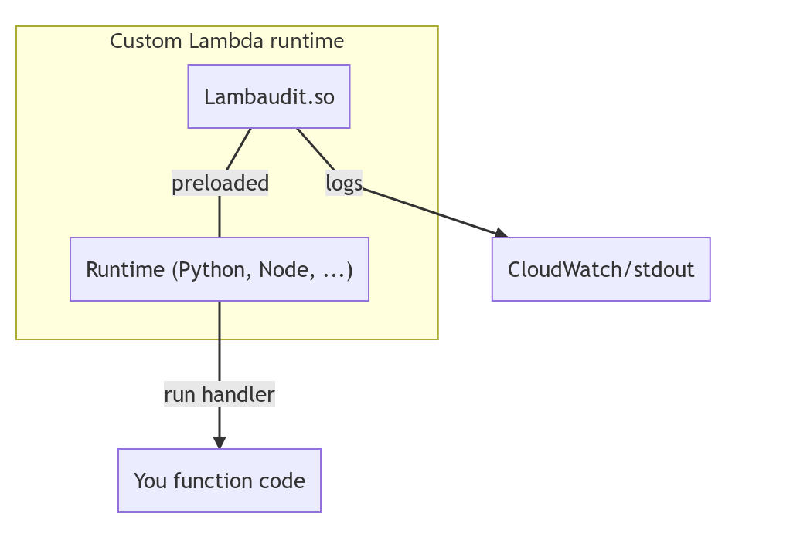
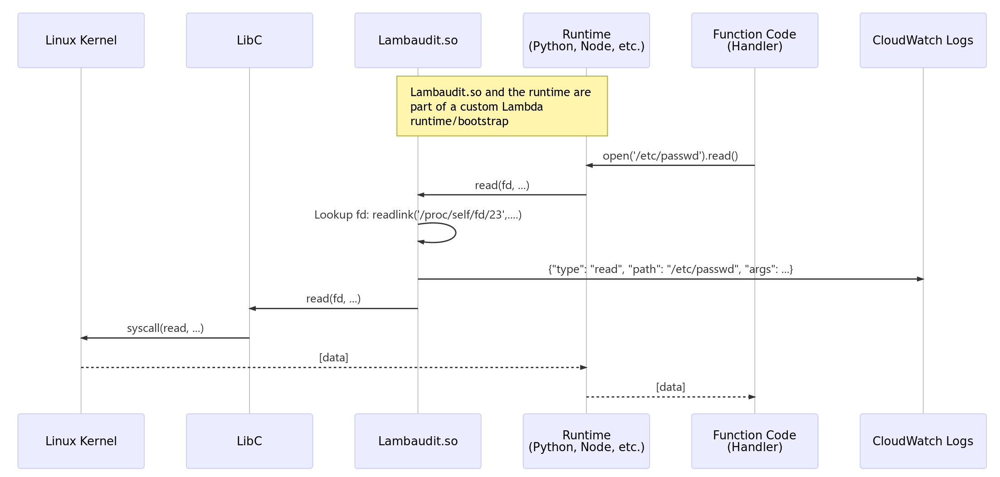

# lambaudit
Syscall-like auditing for Lambda functions in AWS


## What is this?

This emulates having a setup such as Linux Audit (e.g.: https://github.com/gdestuynder/audisp-json) running, but within
Lambda functions.

It logs your function's read, write, exec, etc. calls to CloudWatch.


### Status

This is a proof-of-concept. It currently only supports a `bash` runtime and sample function calls without much
fancyness.


### How do I run this?

```
# Compile and pack the runtime
$ make

# Create the function
$ make create

# Test run it?
$ make invoke
```

[](https://asciinema.org/a/TYHEIJSIZqFy4PNMN8KHWqDKw)


For your own function code, simply use this as the first layer.

## How does it work?

Lambaudit works by replacing well-known function addresses by it's own wrapper. The wrapper logs information about the
call to CloudWatch then runs the original function - i.e. function hooking.
The functions are stored in a library (the `.so` file) and preloaded so that it overwrite `libc` calls such as `read`,
`write`, `execve`, `connect`, etc.
Additional lookups are made in-function, for example to get the path of a file instead of it's file descriptor.

Here's a visual way to see how this works:



Or a more functional one:




## Considerations

AWS Lambda functions run in https://github.com/firecracker-microvm/firecracker which is a small virtualized container
solution. Each function runs in it's own new or re-used container-vm.

### Security

Each function runs in it's own new or re-used container-vm. Each container-vm is hardened in several ways, in
particular:

- ptrace syscall options are not allowed (`PTRACE_TRACEME`, etc.), which means `strace` and similar programs will not
  work.
- LKMs are not allowed, which means you cannot load your own kernel modules.
- The `audit` syscall is disabled, which means you cannot configure it or load events from it.
- Function call hooking is easy to bypass for someone with knowledge of this code being present. Several anti-debugging
  methods can be used or added in order to make this more difficult, but it's not impossible. A parallel can be drawn
with how user-space rootkits function, or how games protection against cracks function.

### Performance

- ptrace is slow, that said, it can't be used here anyway as it's disabled.
- I've not tried running a vm-within-the-vm as the performance would be pretty bad. That said, if there is a kvm
  passthrough, it could be decent. I've not checked this but I would be surprised if it's enabled.

### Firecracker & TPMs

If kvm passthrough is enabled, it would be interesting to run a monitored VM where the calls would be intercepted by a
virtual TPM. This is by far my preferred solution, however, this should probably be implemented in Firecracker directly
instead.
